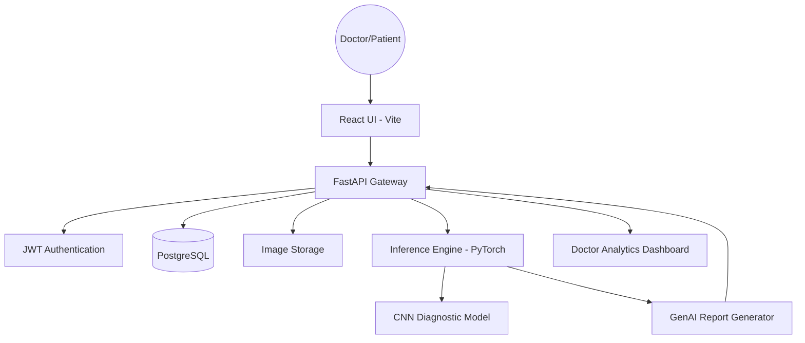
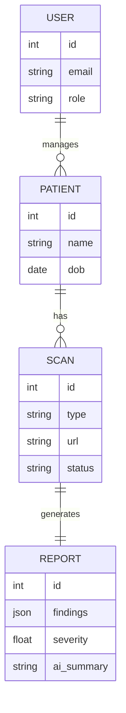

# MedFusion AI — Implementation & Documentation

## 1. Architecture Diagram (Mermaid)



## 2. ER Diagram



## 3. Deployment Steps

### Local Setup
1. **Clone the repository:**
   `git clone <repo-url>`
2. **Setup environment:**
   Create a `.env` file in the root directory.
3. **Run with Docker:**
   ```bash
   docker-compose up --build
   ```
4. **Access the application:**
   - Frontend: `http://localhost:5173`
   - Backend API Docs: `http://localhost:8000/docs`

### Manual Backend Setup
1. `cd backend`
2. `pip install -r requirements.txt`
3. `uvicorn app.main:app --reload`

### Manual Frontend Setup
1. `cd frontend`
2. `npm install`
3. `npm run dev`

---

## 4. Dataset Sources (Recommended)
To train the models for production, use the following open-source datasets:
- **Dental:** [Dental Caries Dataset (Kaggle)](https://www.kaggle.com/datasets/felipefiorini/dental-caries-xray)
- **Orthopedic (Fractures):** [MURA - Musculoskeletal Radiographs (Stanford)](https://stanfordmlgroup.github.io/competitions/mura/)
- **Spine:** [Spine Segmentation (Kaggle)](https://www.kaggle.com/datasets/vbookshelf/spine-xray-dataset)

---

## 5. API Documentation Snippet
### `POST /scans/upload/`
- **Description:** Uploads a medical scan for AI analysis.
- **Parameters:** `patient_id` (int), `scan_type` (string), `file` (Multipart).
- **Return:** `scan_id` and initial processing status.

### `GET /reports/{scan_id}`
- **Description:** Retrieves the AI-generated report for a specific scan.
- **Return:** Findings, severity score, and narrative summary.
